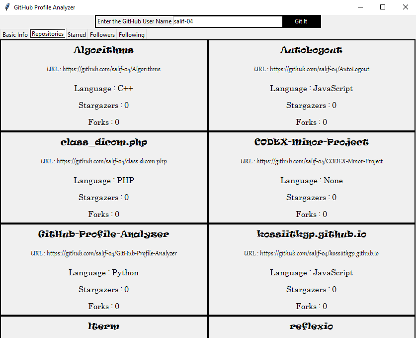

# GitHub-Profile-Analyzer
#### A GitHub Profile Analyzer that will provide all the basic information of the GitHub profile using the GitHub API v3. The rate limit for unauthorized users is 60 requests per hour. SO the use of this app is limited to 8 profiles per hour. We are planning to  add few more features and increase the limit to 500 profiles per hour by making authorized requests to the API.

## Pre-requisites
* Requests
* JSON
* Tkinter
* PIL

## Steps
* ### Clone the repository
    `git clone https://github.com/salif-04/GitHub-Profile-Analyzer`
* ### Navigate to the directory
    `cd GitHub-Profile-Analyzer/Gui`
* ### Execute the program
    `python3 gitHubProfileAnalyzer.py`

## Screenshots
* ### Index

* ### Basic Info

* ### Repositories

* ### Starred Repositories

* ### Followers

* ### Followings

